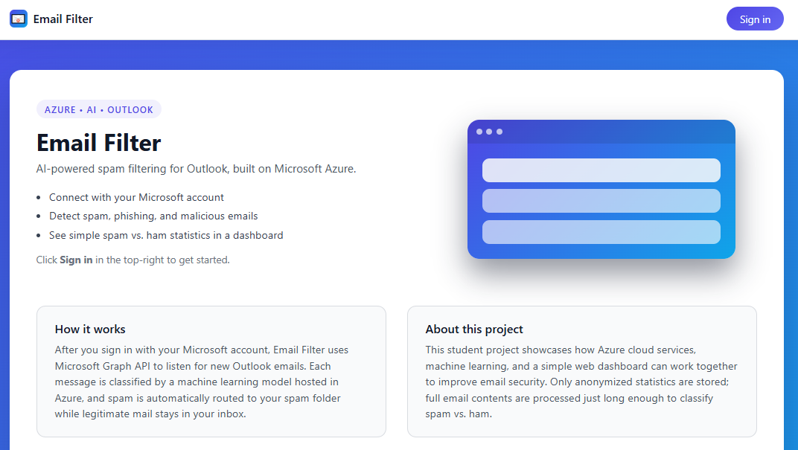

# Post-Delivery Email Spam Filter for Outlook

## Project Overview

This **Post-Delivery Email Spam Filter** is a project designed to analyze emails *after* they have arrived in a Microsoft Outlook inbox. Unlike traditional server-side spam filters that block messages before delivery, this tool operates client-side (or via Outlook add-in/API integration) to classify emails as **spam** or **ham (non-spam)** post-delivery.

Upon classification:
- Spam emails are **automatically moved** to the Junk folder accordingly. Ham emails remain untouched.
- Classification data is **logged** in a cloud database.
- Real-time **statistics and analytics** are displayed on a **web-based dashboard** for user monitoring.

This project demonstrates concepts in:
- Email API integration **(Microsoft Graph API / Outlook)**
- Machine learning for text classification **(XGBoost)**
- Database logging and data persistence **(MongoDB)**
- Full-stack web development **(React + Bootstrap)**
- Automation and rule-based email management **(Microsoft Graph API, Express)**

---

## Features

| Feature | Description |
|-------|-----------|
| **Post-Delivery Scanning** | Scans emails only *after* they land in the Inbox |
| **ML-Based Classification** | Uses an in-house XGBoost model on email body and subject for classification. |
| **Automated Actions** | Moves spam to Junk/Quarantine folder appropriately. |
| **Detailed Logging** | Stores classification data in database for analytic purposes.|
| **Interactive Dashboard** | View spam trends and filter performance. |
---

**You can check out our app currently hosted [here](https://emailfilter-plum.vercel.app/)! Created from [Microsoft's React-SPA + MSAL Quick Setup](https://github.com/Azure-Samples/ms-identity-docs-code-javascript/tree/main/react-spa) template.**

**NOTE: Currently, the project only works well with data from our training/testing sets so if you wish to accurately gauge the performance, we recommend using observations from any of the [cleaned datasets](https://github.com/RyanEisele1012/Email_Filter/tree/main/Model/Cleaned%20Datasets) here.**
